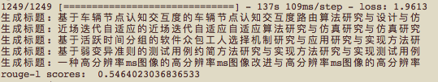
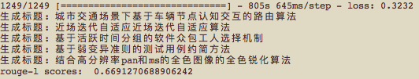

## CSL 运行结果

在每一轮训练结束后会输出 example.tsv 的预测结果，
本页面展示的是各模型在最后一轮训练的表现。

1. BERT_base 


2. BERT_wwm_ext 


3. ALBERT_tiny



4. RoBERTa_wwm_ext



5. RoBERTa_wwm_large

```$xslt
- 2002s - loss: 0.1047
生成标题: 城市交通场景下基于车辆节点认知交互的路由算法
生成标题: 近场信源自适应近场迭代自适应算法
生成标题: 基于活跃时间分组的软件众包工人选择机制
生成标题: 基于弱变异准则的测试用例约简方法
生成标题: 一种改进的全色锐化算法及其在ms图像中的应用
rouge-l scores:  0.6810021277286873
```

6. LSTM_Seq2Seq
```$xslt
- 115s 115ms/step - loss: 0.0672 - val_loss: 13.9840
生成标题:  车联网监护交互环境下面联机路分路
生成标题:  基于迭代数匀自适应方程的近邻自适应方案
生成标题:  基于时间间变组的计算机制软件定制及其转换博性分析
生成标题:  基于弱透变的测试用例约简方法
生成标题:  基于稀疏表示的全变化学化算法
rouge-l scores:  0.39732327786821486
```
