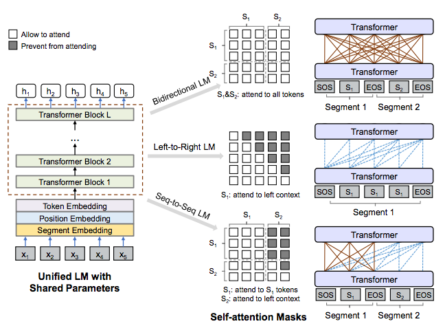
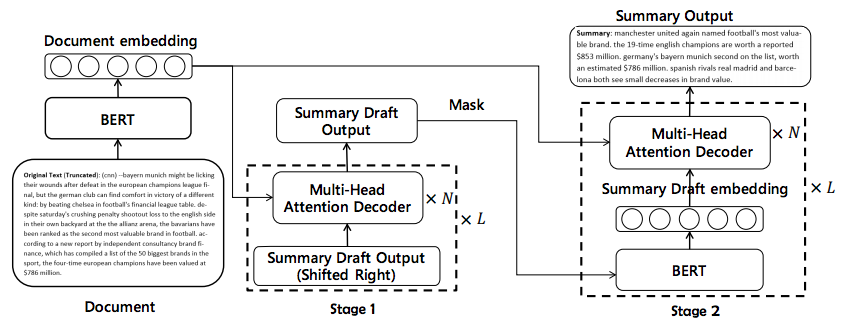

BERT 类模型可以直接用于各种下游 NLP 任务，例如文本分类、命名实体识别和机器阅读理解等。
但是对于文本生成类（NLG）任务，BERT 在预训练时使用双向语言模型与单向的文本生成目标不一致，
导致 BERT 在文本生成的表现并不好。

因此，将 BERT 用于文本生成需要一些改动，以下是一些研究者的尝试：

1. [Unified Language Model Pre-training for Natural Language Understanding and Generation](https://arxiv.org/abs/1905.03197)

UNILM 通过对 BERT 的注意力矩阵进行 mask 实现单向输出的语言模型。

2. [Pretraining-Based Natural Language Generation for Text Summarization](https://arxiv.org/abs/1902.09243 )

以两阶段的方式使用两个 BERT 进行编码和解码实现 Encoder-Decoder 架构。

